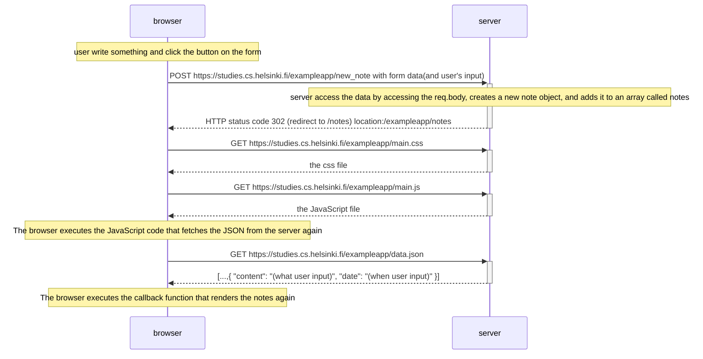

```mermaid
sequenceDiagram
    participant browser
    participant server

    Note over browser: user write something and click the button on the form

    browser->>+server: POST https://studies.cs.helsinki.fi/exampleapp/new_note with form data(and user's input)
    Note over server: server access the data by accessing the req.body, creates a new note object, and adds it to an array called notes
    server-->>-browser: HTTP status code 302 (redirect to /notes) location:/exampleapp/notes

    browser->>+server: GET https://studies.cs.helsinki.fi/exampleapp/main.css
    server-->>-browser: the css file

    browser->>+server: GET https://studies.cs.helsinki.fi/exampleapp/main.js
    server-->>-browser: the JavaScript file

    Note over browser: The browser executes the JavaScript code that fetches the JSON from the server again

    browser->>+server: GET https://studies.cs.helsinki.fi/exampleapp/data.json
    server-->>-browser: [...,{ "content": "(what user input)", "date": "(when user input)" }]

    Note over browser: The browser executes the callback function that renders the notes again
```