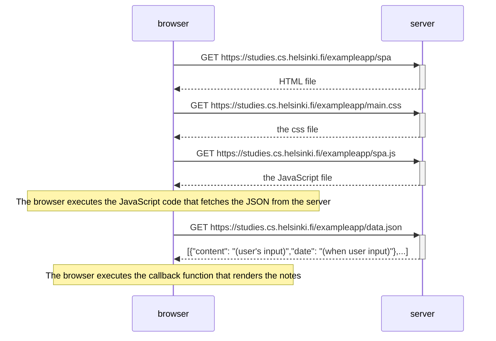

```mermaid
sequenceDiagram
    participant browser
    participant server

    browser->>+server: GET https://studies.cs.helsinki.fi/exampleapp/spa
    server-->>-browser: HTML file

    browser->>+server: GET https://studies.cs.helsinki.fi/exampleapp/main.css
    server-->>-browser: the css file

    browser->>+server: GET https://studies.cs.helsinki.fi/exampleapp/spa.js
    server-->>-browser: the JavaScript file

    Note over browser: The browser executes the JavaScript code that fetches the JSON from the server

    browser->>+server: GET https://studies.cs.helsinki.fi/exampleapp/data.json
    server-->>-browser: [{"content": "(user's input)","date": "(when user input)"},...]

    Note over browser: The browser executes the callback function that renders the notes
```