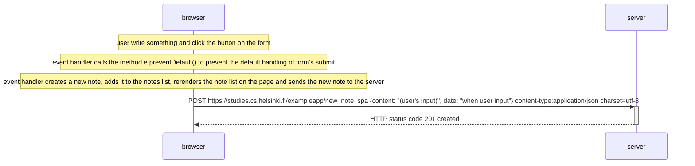

```mermaid
sequenceDiagram
    participant browser
    participant server

    Note over browser: user write something and click the button on the form
    Note over browser: event handler calls the method e.preventDefault() to prevent the default handling of form's submit
    Note over browser: event handler creates a new note, adds it to the notes list, rerenders the note list on the page and sends the new note to the server

    browser->>+server: POST https://studies.cs.helsinki.fi/exampleapp/new_note_spa {content: "(user's input)", date: "when user input"} content-type:application/json charset=utf-8
    server-->>-browser: HTTP status code 201 created


```